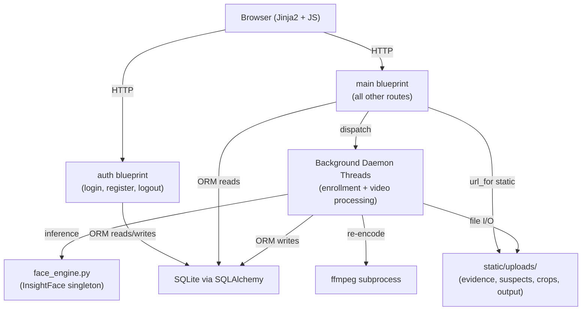
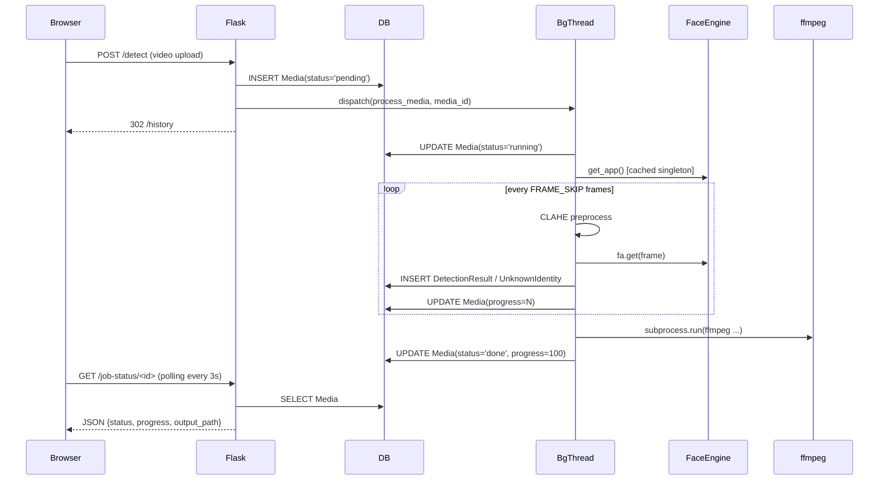
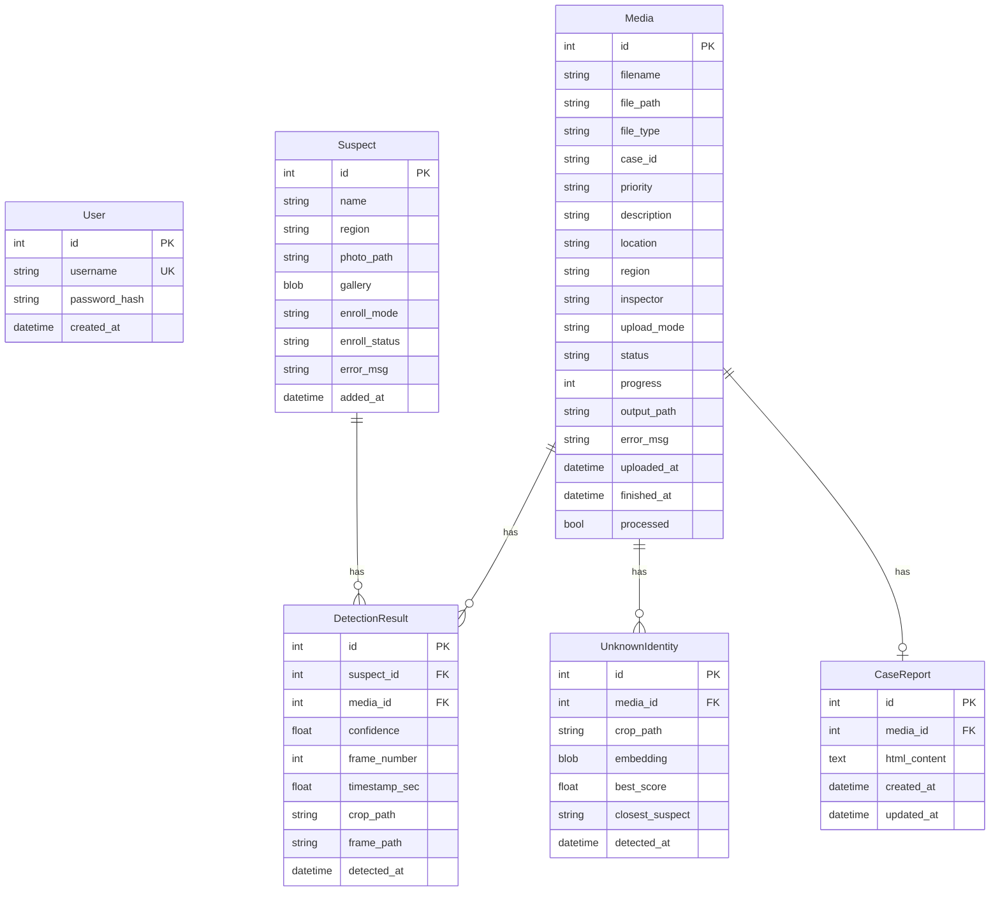

# Design Document — CrimAI Flask Application

## Overview

CrimAI is a production-grade Flask web application for law enforcement surveillance and automated face recognition. It migrates and significantly expands an existing Streamlit prototype into a multi-user, role-authenticated system with a persistent relational database, an asynchronous AI processing pipeline, and rich case-reporting capabilities.

The application is built around three core concerns:

1. **Identity Management** — enrolling suspects into a watchlist with face embeddings built from uploaded photos.
2. **Evidence Processing** — uploading image/video evidence, running face recognition against the watchlist in background threads, and storing structured results.
3. **Case Reporting** — browsing history, viewing annotated results, composing rich-text reports, and monitoring KPIs on a dashboard.

### Key Design Decisions

| Decision | Choice | Rationale |
|---|---|---|
| Web framework | Flask with application factory | Lightweight, testable, supports blueprints for clean separation |
| ORM | SQLAlchemy | Declarative models, cascade deletes, no raw SQL in routes |
| Face model | InsightFace `buffalo_l` | Same as prototype; singleton pre-warmed at startup |
| Background work | Python daemon threads | No external queue dependency; sufficient for single-server deployment |
| Video re-encoding | ffmpeg via `subprocess.run` | Browser-compatible H.264 MP4 without Python codec dependencies |
| Charts | HTML5 Canvas (vanilla JS) | No external chart library; full control over dark/light theme |
| Auth | Flask-Login + Werkzeug PBKDF2 | Standard Flask auth stack; no JWT complexity needed |
| Theme | CSS custom properties | Single stylesheet supports dark/light toggle via class swap |

---

## Architecture

### High-Level Component Diagram



### Request Lifecycle



### Application Factory

```
create_app(config_object=None)
  ├── load config from config.py
  ├── init SQLAlchemy (db.init_app)
  ├── init Flask-Login (login_manager.init_app)
  ├── create all tables (db.create_all)
  ├── pre-warm FaceEngine (get_app())
  ├── register auth blueprint  (/auth)
  └── register main blueprint  (/)
```

---

## Components and Interfaces

### Module Responsibilities

| Module | Responsibility |
|---|---|
| `app.py` | `create_app()` factory; blueprint registration; FaceEngine pre-warm |
| `config.py` | All constants: thresholds, paths, model params, upload extensions |
| `models.py` | SQLAlchemy ORM models: `User`, `Suspect`, `Media`, `DetectionResult`, `UnknownIdentity`, `CaseReport` |
| `auth.py` | Flask blueprint: `/register`, `/login`, `/logout`, `/forgot-password` |
| `main.py` | Flask blueprint: all other routes; background thread dispatch |
| `face_engine.py` | InsightFace singleton; `enroll_single()`, `enroll_group_image()`, `process_media()` pipeline |

### `config.py` — Key Constants

```python
# Model
MODEL_NAME          = "buffalo_l"
DET_SIZE_CPU        = (640, 640)
DET_SIZE_GPU        = (1024, 1024)
DET_THRESH          = 0.35
SIMILARITY_THRESH   = 0.50
FRAME_SKIP          = 3
ALERT_DURATION_FRAMES = 45

# Paths (relative to app root)
STATIC_FOLDER       = "static"
UPLOAD_EVIDENCE     = "static/uploads/evidence"
UPLOAD_SUSPECTS     = "static/uploads/suspects"
UPLOAD_CROPS        = "static/uploads/crops"
UPLOAD_OUTPUT       = "static/uploads/output"

# Auth
SECRET_KEY          = os.environ.get("SECRET_KEY", "dev-secret-change-me")

# Upload
ALLOWED_IMAGE_EXT   = {"jpg", "jpeg", "png"}
ALLOWED_VIDEO_EXT   = {"mp4", "avi", "mov", "mkv"}

# Regions
REGIONS = ["North", "South", "East", "West", "Central", "Unknown"]
```

### `face_engine.py` — Public Interface

```python
_fa: FaceAnalysis | None = None   # module-level singleton

def get_app() -> FaceAnalysis | None:
    """Return cached FaceAnalysis singleton; initialise on first call."""

def preprocess_frame(frame: np.ndarray) -> np.ndarray:
    """Apply CLAHE to BGR frame; return enhanced BGR frame."""

def get_face_embedding(fa, img_bgr) -> tuple[np.ndarray | None, face | None]:
    """Detect largest face; return (L2-normalised embedding, face object) or (None, None)."""

def enroll_single(app, suspect_id: int) -> None:
    """Background thread target: build Gallery for a single-photo Suspect."""

def enroll_group_image(app, temp_path: str) -> None:
    """Background thread target: detect all faces in group photo; create one Suspect per face."""

def process_media(app, media_id: int) -> None:
    """Background thread target: run full detection pipeline on a Media record."""

def load_all_embeddings() -> dict[str, list[np.ndarray]]:
    """Return {suspect_label: [embedding, ...]} for all ready Suspects."""

def match_embedding(emb, suspect_embeddings) -> tuple[str | None, float]:
    """Return (best_label, best_score) or (None, 0.0) against all galleries."""

def _to_relative(abs_path: str) -> str:
    """Strip static folder prefix from an absolute path; return relative path."""
```

### `auth.py` — Routes

| Route | Method | Description |
|---|---|---|
| `/auth/register` | GET, POST | Registration form; hash password; create User |
| `/auth/login` | GET, POST | Login form; validate credentials; create session |
| `/auth/logout` | GET | Invalidate session; redirect to login |
| `/auth/forgot-password` | GET, POST | Placeholder reset flow |

### `main.py` — Routes

| Route | Method | Description |
|---|---|---|
| `/` | GET | Redirect to `/dashboard` |
| `/dashboard` | GET | KPI cards, recent detections, canvas charts |
| `/suspects` | GET | Paginated suspect table with live search |
| `/suspects/enroll` | POST | Single-photo enrollment; dispatch background thread |
| `/suspects/enroll-group` | POST | Group-photo enrollment; dispatch background thread |
| `/suspects/delete/<id>` | POST | Delete suspect + cascade + disk files |
| `/detect` | GET, POST | Upload form; create Media records; dispatch processing |
| `/results/<media_id>` | GET | Results viewer with polling JS |
| `/job-status/<media_id>` | GET | JSON status endpoint |
| `/history` | GET | All Media records with search/filter |
| `/reports` | GET | Aggregated statistics and charts |
| `/report/custom/<media_id>` | GET | CaseReport editor (TinyMCE) |
| `/report/custom/save/<media_id>` | POST | AJAX save CaseReport HTML |
| `/regions` | GET | Static region list |
| `/reported_cases` | GET | Media records with associated CaseReports |

---

## Data Models

### Entity-Relationship Diagram



### SQLAlchemy Model Definitions (summary)

```python
class User(db.Model):
    id            = db.Column(db.Integer, primary_key=True)
    username      = db.Column(db.String(80), unique=True, nullable=False)
    password_hash = db.Column(db.String(256), nullable=False)
    created_at    = db.Column(db.DateTime, default=datetime.utcnow)

class Suspect(db.Model):
    id            = db.Column(db.Integer, primary_key=True)
    name          = db.Column(db.String(120), nullable=False)
    region        = db.Column(db.String(80))
    photo_path    = db.Column(db.String(512))
    gallery       = db.Column(db.LargeBinary)          # pickle.dumps(list[np.ndarray])
    enroll_mode   = db.Column(db.String(20), default='single')
    enroll_status = db.Column(db.String(20), default='processing')
    error_msg     = db.Column(db.Text)
    added_at      = db.Column(db.DateTime, default=datetime.utcnow)
    detections    = db.relationship('DetectionResult', backref='suspect',
                                    cascade='all, delete-orphan')

class Media(db.Model):
    id            = db.Column(db.Integer, primary_key=True)
    filename      = db.Column(db.String(256))
    file_path     = db.Column(db.String(512))
    file_type     = db.Column(db.String(10))           # 'image' | 'video'
    case_id       = db.Column(db.String(80))
    priority      = db.Column(db.String(20), default='Medium')
    description   = db.Column(db.Text)
    location      = db.Column(db.String(256))
    region        = db.Column(db.String(80))
    inspector     = db.Column(db.String(120))
    upload_mode   = db.Column(db.String(20))
    status        = db.Column(db.String(20), default='pending')
    progress      = db.Column(db.Integer, default=0)
    output_path   = db.Column(db.String(512))
    error_msg     = db.Column(db.Text)
    uploaded_at   = db.Column(db.DateTime, default=datetime.utcnow)
    finished_at   = db.Column(db.DateTime)
    processed     = db.Column(db.Boolean, default=False)
    detections    = db.relationship('DetectionResult', backref='media',
                                    cascade='all, delete-orphan')
    unknowns      = db.relationship('UnknownIdentity', backref='media',
                                    cascade='all, delete-orphan')
    report        = db.relationship('CaseReport', backref='media',
                                    cascade='all, delete-orphan', uselist=False)

class DetectionResult(db.Model):
    id            = db.Column(db.Integer, primary_key=True)
    suspect_id    = db.Column(db.Integer, db.ForeignKey('suspect.id', ondelete='CASCADE'))
    media_id      = db.Column(db.Integer, db.ForeignKey('media.id', ondelete='CASCADE'))
    confidence    = db.Column(db.Float)
    frame_number  = db.Column(db.Integer)
    timestamp_sec = db.Column(db.Float)
    crop_path     = db.Column(db.String(512))
    frame_path    = db.Column(db.String(512))
    detected_at   = db.Column(db.DateTime, default=datetime.utcnow)

class UnknownIdentity(db.Model):
    id              = db.Column(db.Integer, primary_key=True)
    media_id        = db.Column(db.Integer, db.ForeignKey('media.id', ondelete='CASCADE'))
    crop_path       = db.Column(db.String(512))
    embedding       = db.Column(db.LargeBinary)        # pickle.dumps(np.ndarray)
    best_score      = db.Column(db.Float)
    closest_suspect = db.Column(db.String(120))
    detected_at     = db.Column(db.DateTime, default=datetime.utcnow)

class CaseReport(db.Model):
    id           = db.Column(db.Integer, primary_key=True)
    media_id     = db.Column(db.Integer, db.ForeignKey('media.id', ondelete='CASCADE'),
                             unique=True)
    html_content = db.Column(db.Text)
    created_at   = db.Column(db.DateTime, default=datetime.utcnow)
    updated_at   = db.Column(db.DateTime, default=datetime.utcnow,
                             onupdate=datetime.utcnow)
```

### Path Storage Convention

All file paths stored in the database are **relative to the static folder root** (e.g., `uploads/evidence/abc123.mp4`). The `_to_relative()` helper strips the `static/` prefix before writing. Templates reconstruct full URLs via `url_for('static', filename=path)`.

---

## Correctness Properties

*A property is a characteristic or behavior that should hold true across all valid executions of a system — essentially, a formal statement about what the system should do. Properties serve as the bridge between human-readable specifications and machine-verifiable correctness guarantees.*

### Property 1: Gallery Serialisation Round-Trip

*For any* valid list of float32 numpy arrays (a Gallery), serialising it with `pickle.dumps()` and then deserialising with `pickle.loads()` SHALL produce a list of numpy arrays that are element-wise equal to the originals.

**Validates: Requirements 16.1, 16.2, 16.3**

---

### Property 2: Embedding Serialisation Round-Trip

*For any* valid float32 numpy array (an Embedding), serialising it with `pickle.dumps()` and then deserialising with `pickle.loads()` SHALL produce a numpy array that is element-wise equal to the original.

**Validates: Requirements 16.4, 16.5**

---

### Property 3: Relative Path Stripping

*For any* absolute file path that begins with the static folder prefix, calling `_to_relative()` SHALL return a path that does not begin with the static folder prefix and, when the static prefix is prepended, reconstructs the original path.

**Validates: Requirements 18.5, 18.6**

---

### Property 4: Match Threshold Enforcement

*For any* face embedding and any set of suspect galleries, `match_embedding()` SHALL return a non-None label if and only if the maximum cosine similarity across all gallery embeddings is greater than or equal to `SIMILARITY_THRESH`.

**Validates: Requirements 7.4**

---

### Property 5: Cosine Similarity Bounds

*For any* two L2-normalised float32 embeddings, the cosine similarity computed by `match_embedding()` SHALL be in the range [-1.0, 1.0].

**Validates: Requirements 7.4**

---

### Property 6: Password Hash Non-Reversibility

*For any* plaintext password string, the stored `password_hash` produced by `generate_password_hash()` SHALL NOT equal the plaintext password, and `check_password_hash(hash, password)` SHALL return `True` for the original password and `False` for any different string.

**Validates: Requirements 1.2, 1.8**

---

## Error Handling

### FaceEngine Initialisation Failure

If `get_app()` raises an exception at startup (missing model files, ONNX runtime error), `create_app()` catches the exception, logs it at `ERROR` level, and sets the singleton to `None`. All routes that depend on face recognition check `get_app() is not None` before dispatching background threads and return a user-facing flash message if the engine is unavailable.

### Background Thread Exceptions

All background thread targets (`enroll_single`, `enroll_group_image`, `process_media`) wrap their entire body in a `try/except Exception`. On failure:
- `enroll_single`: sets `suspect.enroll_status = 'failed'` and `suspect.error_msg = str(e)`.
- `process_media`: sets `media.status = 'failed'` and `media.error_msg = str(e)`.
- All failures are logged at `ERROR` level with a full traceback.

### HTTP Error Responses

| Condition | Response |
|---|---|
| Unauthenticated request to protected route | 302 redirect to `/auth/login` |
| `media_id` not found in `/job-status/<id>` | JSON `{"error": "not found"}`, HTTP 404 |
| `media_id` not found in `/report/custom/save/<id>` | JSON `{"error": "not found"}`, HTTP 404 |
| File upload with disallowed extension | Flash error; redirect back to form |
| Duplicate username on registration | Flash error; re-render form |
| Invalid login credentials | Flash error; re-render form |

### ffmpeg Failure

If `subprocess.run(ffmpeg_cmd)` returns a non-zero exit code, `process_media()` logs the stderr output and falls back to using the OpenCV-written output file directly (which may not be browser-playable). The `error_msg` column is updated with a warning but `status` is still set to `'done'` so the results page renders.

### File I/O Errors

Upload directories are created at startup via `os.makedirs(..., exist_ok=True)`. If a write fails (disk full, permissions), the exception propagates to the background thread handler and sets `status='failed'`.

---

## Testing Strategy

### Dual Testing Approach

The testing strategy combines **unit/example-based tests** for specific behaviours and **property-based tests** for universal correctness guarantees.

### Property-Based Testing

Property-based tests use **Hypothesis** (Python) with a minimum of **100 iterations** per property. Each test is tagged with a comment referencing the design property it validates.

```
# Feature: crimai-flask-app, Property 1: Gallery serialisation round-trip
```

**Properties to implement as PBT:**

| Property | Test Strategy |
|---|---|
| P1: Gallery round-trip | Generate lists of random float32 arrays; assert element-wise equality after pickle round-trip |
| P2: Embedding round-trip | Generate random float32 arrays; assert element-wise equality after pickle round-trip |
| P3: Relative path stripping | Generate random filename strings; prepend static prefix; assert `_to_relative` strips it correctly |
| P4: Match threshold enforcement | Generate random embeddings and galleries; assert label is non-None iff max similarity ≥ threshold |
| P5: Cosine similarity bounds | Generate pairs of random normalised embeddings; assert similarity ∈ [-1, 1] |
| P6: Password hash non-reversibility | Generate random password strings; assert hash ≠ plaintext and check_password_hash is correct |

### Unit / Example-Based Tests

- **Auth routes**: register with unique username succeeds; duplicate username returns error; login with valid credentials creates session; login with invalid credentials does not; logout invalidates session; unauthenticated request redirects to login.
- **Job status API**: returns 200 JSON for existing media_id; returns 404 for missing media_id.
- **CaseReport save**: POST with valid HTML creates/updates record; POST with missing media_id returns 404.
- **Suspect deletion**: deletes suspect record, cascades to DetectionResult, removes disk files.
- **Media creation**: correct `file_type` assigned for image vs video extensions.
- **`_to_relative()`**: strips static prefix; handles paths already relative; handles nested paths.
- **`match_embedding()`**: returns `(None, 0.0)` when gallery is empty; returns correct label when single gallery entry exceeds threshold.

### Integration Tests

- **FaceEngine singleton**: calling `get_app()` twice returns the same object instance.
- **Background thread enrollment**: after `enroll_single()` completes, `suspect.enroll_status == 'ready'` and `suspect.gallery` is non-None.
- **Background thread video processing**: after `process_media()` completes on a short test video, `media.status == 'done'` and at least one `DetectionResult` or `UnknownIdentity` record exists.
- **ffmpeg re-encoding**: output file exists and has `.mp4` extension after processing.

### Test Configuration

```
pytest
├── tests/
│   ├── conftest.py          # Flask test client, in-memory SQLite, temp upload dirs
│   ├── test_auth.py         # Auth route unit tests
│   ├── test_api.py          # Job status + report save API tests
│   ├── test_face_engine.py  # Unit tests for pipeline helpers
│   ├── test_models.py       # ORM cascade behaviour
│   └── test_properties.py  # Hypothesis property-based tests (P1–P6)
```

All tests use an in-memory SQLite database and temporary directories for file I/O. The FaceEngine is mocked in unit tests to avoid loading the 300 MB ONNX model during CI.
